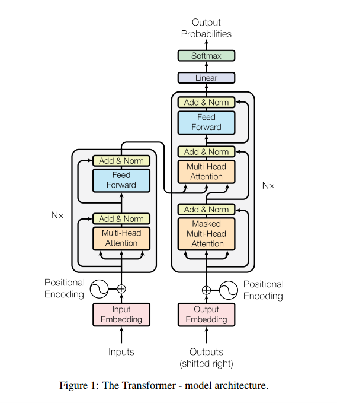
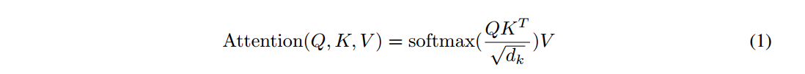
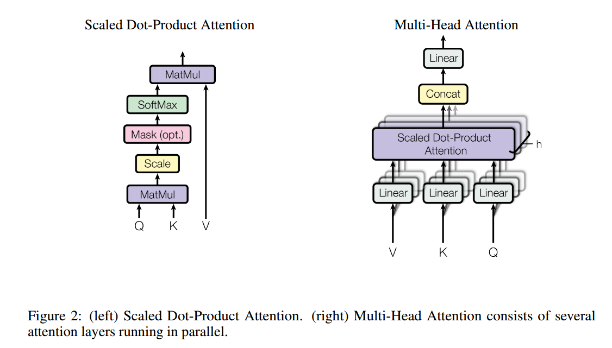
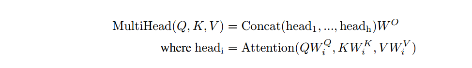
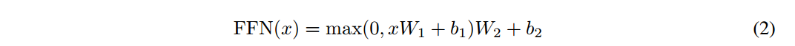

# Attention Is All You Need

注意力就是你所需的一切

这篇比较重要，是transformer的基础

## 摘要

提出了一个新的简单的网络架构，tramsformer，完全基于注意力机制，完全摒弃递归和卷积。可并行，训练效果好。

注意机制已经成为各种任务中引人注目的序列建模和转导模型的组成部分，允许对依赖关系进行建模，而不考虑它们在输入或输出序列中的距离[2,16]。然而，在除少数情况外的所有情况下[22]，这种注意机制都与循环网络结合使用。

在这项工作中，我们提出了Transformer，这是一种避免重复的模型架构，而是完全依赖于注意机制来绘制输入和输出之间的全局依赖关系。

Transformer允许显着更多的并行化，并且在8个P100 gpu上经过12小时的培训后，可以达到翻译质量的新状态。

## 背景

减少顺序计算的目标也构成了Extended Neural GPU[20]、ByteNet[15]和ConvS2S[8]的基础，它们都使用卷积神经网络作为基本构建块，并行计算所有输入和输出位置的隐藏表示。在这些模型中，将两个任意输入或输出位置的信号关联起来所需的操作数量随着位置之间的距离而增长，ConvS2S为线性增长，ByteNet为对数增长。这使得学习距离较远位置之间的依赖关系变得更加困难[11]。在Transformer中，这被减少到一个恒定的操作数量，尽管其代价是由于平均注意加权位置而降低了有效分辨率，我们用3.2节中描述的多头注意抵消了这一影响。

> 总结一下就是以前的模型使得学习距离较远位置之间的依赖关系变得更加困难，但是在Transformer中这个问题不再存在，但是代价是平均注意加权位置导致降低了有效分辨率。解决方案是使用多头注意力机制

自我注意，有时被称为内注意，是一种将单个序列的不同位置联系起来以计算该序列的表示的注意机制。自注意已被成功地应用于阅读理解、抽象总结、文本蕴涵和学习任务无关的句子表征等多种任务中[4,22,23,19]。

据我们所知，Transformer是第一个完全依赖于自注意力来计算其输入和输出表示的模型，而不使用序列对齐rnn或卷积。

## 模型结构

大多数有竞争力的神经序列转导模型具有编码器-解码器结构[5,2,29]。

编码器将输入(x1,x2,...)转变为(z1,z2,...)

给定z，解码器然后生成输出序列(y1，…， ym)符号，一次一个元素。在每一步中，模型都是自回归的[9]，在生成下一个符号时，将之前生成的符号作为额外的输入。

Transformer遵循这个整体架构，使用堆叠的自注意力层和point-wise，完全连接编码器和解码器层，分别如图1的左半部分和右半部分所示。

###  Encoder and Decoder Stacks

**编码器**：编码器由N = 6个相同层的堆栈组成。每一层有两个子层。第一个是多头自注意机制，第二个是一个简单的、位置明智的全连接前馈网络。我们在每一个子层周围使用残差连接[10]，然后进行层归一化[1]。也就是说，每个子层的输出是LayerNorm(x + Sublayer(x))，其中Sublayer(x)是子层本身实现的函数。为了方便这些残差连接，模型中的所有子层以及嵌入层产生的输出维度为dmodel = 512。

**解码器**：解码器也由N = 6层相同的堆栈组成。除了每个编码器层中的两个子层之外，解码器插入第三个子层，该子层对编码器堆栈的输出执行多头注意。与编码器类似，我们在每个子层周围使用残差连接，然后进行层规范化。我们还修改了解码器堆栈中的自注意子层，以防止位置关注后续位置。这种掩蔽，再加上输出嵌入被偏移一个位置的事实，确保了位置i的预测只能依赖于位置小于i的已知输出。

### Attention

注意函数可以描述为将查询和一组键值对映射到输出，其中查询、键、值和输出都是向量。输出是作为值的加权和计算的，其中分配给每个值的权重是由查询与相应键的兼容性函数计算的。

**缩放的点积注意力**

我们称这种特殊的关注为“缩放点积关注”(图2)。输入由维度dk的查询和键以及维度dv的值组成。我们计算查询与所有键的点积，每个点积除以√dk，并应用softmax函数来获得值的权重。在实践中，我们同时计算一组查询的注意力函数，这些查询被打包成矩阵q。键和值也被打包成矩阵K和V。我们计算输出矩阵为:

两种最常用的注意函数是加性注意[2]和点积(乘)注意。点积注意力和我们的算法是一样的，除了比例因子是1√dk。加性注意使用一个具有单个隐藏层的前馈网络来计算兼容性函数。虽然两者在理论复杂性上相似，但在实践中，点积注意力更快，更节省空间，因为它可以使用高度优化的矩阵乘法代码来实现。

当dk值较小时，两种机制的表现相似，当dk值较大时，加性注意优于点积注意[3]。我们怀疑，对于较大的dk值，点积的大小会变大，从而将softmax函数推入具有极小梯度的区域。为了抵消这个影响，我们将点积乘以1√dk。

**多头注意力**

我们发现，与其使用dmodel维度的键、值和查询执行单一的注意力函数，不如将查询、键和值分别以不同的、学习过的线性投影h次线性投影到dk、dk和dv维度，这是有益的。然后，在查询、键和值的每个投影版本上，我们并行地执行注意力函数，生成d维输出值。将它们连接起来并再次进行投影，得到最终值，如图2所示。

多头注意允许模型在不同位置共同注意来自不同表示子空间的信息。对于单一注意力头，平均会抑制这一点。

在这项工作中，我们使用h = 8个平行的注意层，或头。对于每一个，我们使用dk = dv = dmodel/h = 64。由于每个头部的维数降低，因此总计算成本与全维的单头部关注相似。

**注意力在我们模型中的应用**

Transformer以三种不同的方式使用多头注意力:

•在“编码器-解码器注意”层中（这个就是两边的连接处），查询来自前一个解码器层，而键和值来自编码器的输出。这允许解码器中的每个位置都参与输入序列中的所有位置。这模仿了序列到序列模型中典型的编码器-解码器注意机制，如[31,2,8]。（意思是Q来自decoder，K和V来自encoder）

•编码器包含自注意力层。在自注意力层中，所有的键、值和查询都来自同一个地方，在这种情况下，是编码器中前一层的输出。编码器中的每个位置都可以处理编码器前一层中的所有位置。

•类似地，解码器中的自关注层允许解码器中的每个位置关注解码器中的所有位置，直至并包括该位置。我们需要防止解码器中的向左信息流以保持自回归特性。我们通过屏蔽(设置为−∞)softmax输入中对应于非法连接的所有值来实现缩放点积注意力。参见图2。

### Position-wise Feed-Forward Networks

除了注意子层之外，编码器和解码器中的每一层都包含一个完全连接的前馈网络，该网络分别相同地应用于每个位置。这包括两个线性转换，中间有一个ReLU激活。

虽然线性变换在不同位置上是相同的，但它们在每一层之间使用不同的参数。另一种描述它的方式是两个核大小为1的卷积。

输入和输出的维数为dmodel = 512，内层的维数df = 2048。

###  Embeddings and Softmax

与其他序列转导模型类似，我们使用学习嵌入将输入令牌和输出令牌转换为维度dmodel的向量。我们还使用通常学习的线性变换和softmax函数将解码器输出转换为预测的下一个令牌概率。在我们的模型中，我们在两个嵌入层之间共享相同的权重矩阵和pre-softmax线性变换，类似于[24]。在嵌入层中，我们将这些权重乘以√dmodel。

### Positional Encoding

由于我们的模型不包含递归和卷积，为了使模型利用序列的顺序，我们必须注入一些关于序列中标记的相对或绝对位置的信息。为此，我们在输入嵌入中添加了“位置编码”。位置编码与嵌入具有相同的维数模型，因此可以对两者进行求和。位置编码有多种选择，有习得的和固定的[8]。

在这项工作中，我们使用了不同频率的正弦和余弦函数:

我们选择这个函数是因为我们假设它可以让模型很容易地通过相对位置来学习，因为对于任何固定的偏移量k, P Epos+k可以表示为P Epos的线性函数。

我们还尝试使用学习的位置嵌入[8]，并发现这两个版本产生了几乎相同的结果(见表3 (E)行)。我们选择正弦版本是因为它可以允许模型外推到比训练期间遇到的序列长度更长的序列。

## Why Self-Attention

有三个方面的考虑

一个是每层的总计算复杂度。另一个是可以并行化的计算量，通过所需的最小顺序操作数来衡量。

第三个是网络中远程依赖关系之间的路径长度。学习远程依赖关系是许多序列转导任务中的关键挑战。影响学习这种依赖关系能力的一个关键因素是网络中向前和向后信号必须经过的路径长度。输入和输出序列中任意位置组合之间的路径越短，学习远程依赖关系就越容易[11]。因此，我们还比较了由不同层类型组成的网络中任意两个输入和输出位置之间的最大路径长度。

如表1所示，自关注层用恒定数量的顺序执行操作连接所有位置，而循环层需要O(n)个顺序操作。在计算复杂度方面，当序列长度n小于表示维数d时，自注意层比循环层更快，这是机器翻译中最先进模型使用的句子表示最常见的情况，例如词块[31]和字节对[25]表示。

为了提高涉及很长序列的任务的计算性能，可以将自注意限制为只考虑以各自输出位置为中心的输入序列中大小为r的邻域。这将使最大路径长度增加到O(n/r)。我们计划在未来的工作中进一步研究这种方法。

一个核宽度为k < n的卷积层不能连接所有的输入和输出位置对。在相邻核的情况下，这样做需要O(n/k)个卷积层的堆栈，在扩展卷积的情况下需要O(logk(n))个卷积层的堆栈[15]，从而增加网络中任意两个位置之间最长路径的长度。卷积层的成本通常比循环层高k倍。然而，可分离卷积[6]大大降低了复杂性，为O(k·n·d + n·d2)。然而，即使k = n，可分离卷积的复杂性也等于自注意层和点前馈层的组合，这是我们在模型中采用的方法。

作为附带好处，自我关注可以产生更多可解释的模型。我们从我们的模型中检查注意力分布，并在附录中给出和讨论示例。不仅个体注意力头清楚地学会执行不同的任务，许多注意力头似乎表现出与句子的句法和语义结构相关的行为。

