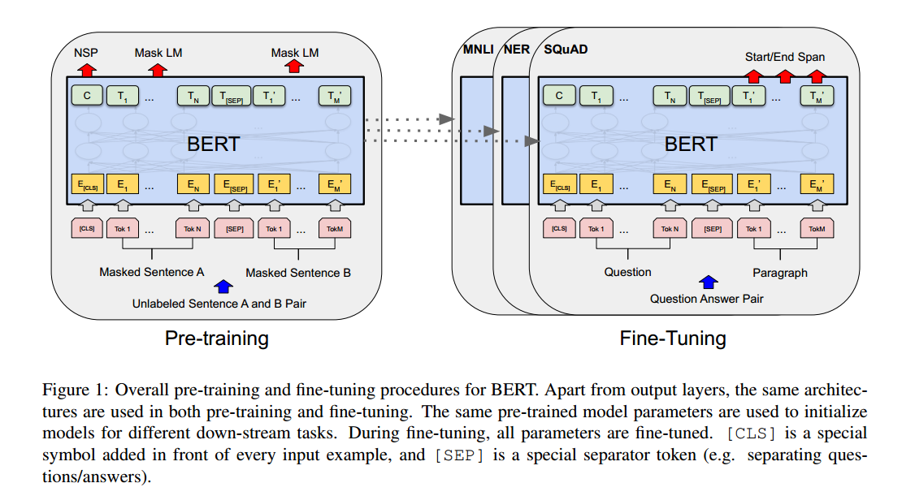
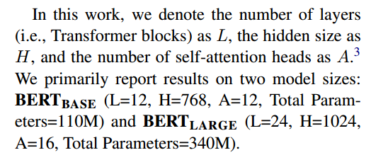

# BERT: Pre-training of Deep Bidirectional Transformers for Language Understanding

BERT:用于语言理解的深度双向变形的预训练

## 摘要

引入了一种新的语言表示模型BERT，它代表来自Transformer的双向编码器表示。与最近的语言表示模型不同(Peters等人，2018a;Radford等人，2018)，BERT旨在通过在所有层中对左右上下文进行联合条件反射，从未标记的文本中预训练深度双向表示。因此，预训练的BERT模型可以通过一个额外的输出层进行微调，从而为广泛的任务(如问答和语言推理)创建最先进的模型，而无需对特定于任务的架构进行大量修改。

BERT在概念上简单，经验上强大。它在11个自然语言处理任务上获得了新的最先进的结果。

## Introduction

语言模型预训练已被证明对改善许多自然语言处理任务是有效的。其中包括句子级任务，如自然语言推理(Bowman et al, 2015;Williams等人，2018)和释义(Dolan和Brockett, 2005)，其目的是通过整体分析来预测句子之间的关系，以及标记级任务，如命名实体识别和问答，其中需要模型在标记级产生细粒度输出(Tjong Kim Sang和De Meulder, 2003;Rajpurkar et al, 2016)。

将预训练的语言表示应用于下游任务有两种现有策略:基于特征和微调。基于特征的方法，如ELMo (Peters等人，2018a)，使用特定于任务的架构，其中包括预训练的表示作为附加特征。微调方法，如生成式预训练转换器(OpenAI GPT) (Radford等人，2018)，引入了最小的任务特定参数，并通过简单地微调所有预训练参数来对下游任务进行训练。这两种方法在预训练过程中具有相同的目标函数，它们使用单向语言模型来学习一般的语言表示。

我们认为**当前的技术限制了预训练表征的力量**，特别是对于**微调**方法。主要的限制是标准语言模型是单向的，这限制了在预训练期间可以使用的体系结构的选择。这种限制对于句子级任务来说是次优的，并且在将基于调优的方法应用于诸如问答之类的令牌级任务时可能非常有害，在这些任务中，结合两个方向的上下文是至关重要的。

BERT通过使用受完形填空任务(Taylor, 1953)启发的“掩模语言模型”(MLM)预训练目标，缓解了前面提到的单向性约束。

掩码语言模型随机屏蔽输入中的一些标记，目标是仅根据其上下文预测被屏蔽词的原始词汇表id。与左右语言模型预训练不同，MLM目标使表示能够融合左右上下文，这允许我们预训练深度双向Transformer。除了屏蔽语言模型，我们还使用了“下一个句子预测”任务，联合预训练文本对表示。本文的贡献如下:

- 我们证明了双向预训练对语言表示的重要性。与Radford等人(2018)使用单向语言模型进行预训练不同，BERT使用屏蔽语言模型来实现预训练的深度双向表示。这也与Peters等人(2018a)形成对比，后者使用独立训练的从左到右和从右到左的LMs的浅连接。

- 我们表明，预训练的表示减少了对许多重型工程任务特定架构的需求。BERT是第一个基于调优的表示模型，它在大量句子级和记号级任务上实现了最先进的性能，优于许多特定于任务的架构。

- BERT在11个NLP任务中推进了最先进的技术。代码和预训练模型可在https://github.com/google-research/bert上获得。

## 相关工作

预训练通用语言表示有很长的历史，我们在本节中简要回顾了最广泛使用的方法。

### 基于无监督特征的方法

几十年来，学习广泛适用的单词表示一直是一个活跃的研究领域，包括非神经的(Brown et al .， 1992;安藤和张，2005;Blitzer et al, 2006)和neural (Mikolov et al, 2013;Pennington et al .， 2014)方法。预训练词嵌入是现代NLP系统的一个组成部分，与从头开始学习的嵌入相比，它提供了显著的改进(Turian et al, 2010)。为了预训练词嵌入向量，使用了从左到右的语言建模目标(Mnih和Hinton, 2009)，以及在左右上下文中区分正确和不正确单词的目标(Mikolov et al .， 2013)。

这些方法已经被推广到更粗的粒度，如句子嵌入(Kiros等，2015;Logeswaran and Lee, 2018)或段落嵌入(Le and Mikolov, 2014)。为了训练句子表征，之前的工作使用目标对候选的下一个句子进行排序(Jernite等人，2017;Logeswaran和Lee, 2018)，根据前一个句子的表示从左到右生成下一个句子单词(Kiros等人，2015)，或者去噪自动编码器派生的目标(Hill等人，2016)。

**ELMo**及其前身(Peters et al .， 2017,2018a)将传统的词嵌入研究从不同的维度进行了概括。他们从从左到右和从右到左的语言模型中提取上下文敏感的特征。每个标记的上下文表示是从左到右和从右到左表示的连接。

当将上下文词嵌入与现有的任务特定架构集成时，ELMo在几个主要的NLP基准(Peters等人，2018a)中推进了最先进的技术，包括问答(Rajpurkar等人，2016)、情感分析(Socher等人，2013)和命名实体识别(Tjong Kim Sang和De Meulder, 2003)。Melamud等人(2016)提出通过使用lstm从左右上下文中预测单个单词的任务来学习上下文表示。与ELMo类似，他们的模型是基于特征的，而不是深度双向的。Fedus等人(2018)表明，完形填空任务可以用来提高文本生成模型的鲁棒性。

### 无监督微调方法

与基于特征的方法一样，第一种方法只从未标记的文本中预训练词嵌入参数(Collobert和Weston, 2008)。最近，产生上下文令牌表示的句子或文档编码器已经从未标记的文本中进行了预训练，并针对监督的下游任务进行了微调(Dai和Le, 2015;Howard and Ruder, 2018;Radford et al, 2018)。这些方法的优点是很少有参数需要从头学习。至少部分由于这一优势，OpenAI GPT (Radford等人，2018)在GLUE基准的许多句子级任务上取得了以前最先进的结果(Wang等人，2018a)。

### 从监督数据迁移学习

也有研究表明，大型数据集的监督任务可以有效转移，例如自然语言推理(Conneau等人，2017)和机器翻译(McCann等人，2017)。计算机视觉研究也证明了从大型预训练模型迁移学习的重要性，其中一个有效的方法是对使用ImageNet预训练的模型进行微调(Deng et al .， 2009;Yosinski et al, 2014)。

## BERT

我们将在本节中介绍BERT及其详细实现。在我们的框架中有两个步骤:预训练和微调。在预训练过程中，模型在不同的预训练任务上对未标记数据进行训练。对于微调，首先使用预训练的参数初始化BERT模型，然后使用来自下游任务的标记数据对所有参数进行微调。每个下游任务都有单独的微调模型，即使它们是用相同的预训练参数初始化的。图1中的问答示例将作为本节的运行示例。

图1：BERT的整体预训练和微调程序。除了输出层，在预训练和微调中也使用了相同的架构。使用相同的预训练模型参数来初始化不同下游任务的模型。在微调期间，对所有参数进行微调。[CLS]是添加在每个输入示例前面的特殊符号，[SEP]是一个特殊的分隔符号(例如，分隔问题/答案)。

BERT的一个显著特征是其跨不同任务的统一架构。预训练架构和最终的下游框架之间只有微小的差距。

BERT的模型架构是一个多层双向变压器编码器，基于Vaswani等人(2017)描述的原始实现，并在tensor2tensor库中发布由于Transformer的使用已经变得普遍，并且我们的实现几乎与原始版本相同，因此我们将省略对模型体系结构的详尽背景描述，并将读者推荐给Vaswani等人(2017)以及优秀的指南，例如“the Annotated Transformer”

为了进行比较，选择BERTBASE与OpenAI GPT具有相同的模型大小。

然而，关键的是，BERT Transformer使用双向自关注，而GPT Transformer使用约束自关注，其中每个令牌只能关注其左侧的上下文。

我们使用WordPiece嵌入(Wu et al .， 2016)和30,000个标记词汇表。每个序列的第一个标记总是一个特殊的分类标记([CLS])。与此令牌对应的最终隐藏状态用作分类任务的聚合序列表示。句子对被打包成一个单一的序列。我们用两种方法区分句子。首先，我们用一个特殊的令牌([SEP])将它们分开。其次，我们为每一个标记添加一个学习嵌入，表明它属于句子a还是句子b。如图1所示，我们将输入嵌入表示为E，特殊[CLS]标记的最终隐藏向量表示为C∈R H，第i个输入标记的最终隐藏向量表示为Ti∈R H。