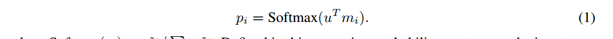

# End-To-End Memory Networks

我们在可能较大的外部存储器上引入了一个具有循环注意模型的神经网络。该架构是记忆网络的一种形式，但与该工作中的模型不同，它是端到端训练的，因此在训练过程中需要的监督要少得多，使其更普遍适用于现实环境。

> 端到端是什么意思？指的是通过一个统一的模型或系统直接从原始输入端到最终输出端完成任务，而无需人工设计中间阶段的特征或处理步骤。

## Introduction

人工智能研究面临的两大挑战是建立能够在回答问题或完成任务的过程中进行多个计算步骤的模型，以及能够描述顺序数据中的长期依赖关系的模型。

我们的模型也可以被看作是RNNsearch的一个版本，每个输出符号有多个计算步骤(我们称之为“跳数”)。我们将通过实验证明，长期记忆的多跳对于我们的模型在这些任务上的良好性能至关重要，并且训练记忆表示可以以可扩展的方式集成到我们的端到端神经网络模型中。

## Approach

我们的模型取一个离散的输入集合x1，…， xn，将存储在内存中，查询q，并输出答案a。

xi, q和a中的每一个都包含来自有V个单词的字典的符号。该模型将所有x写入到内存中，直到一个固定的缓冲区大小，然后为x和q找到一个连续的表示。然后通过多跳处理连续表示以输出a。这允许在训练期间通过多次内存访问将错误信号反向传播回输入。

先一层一层地来看

输入内存表示:假设给定一个输入集合x1，…， xi要存储在内存中。

$x_i$被转化为d维向量$m_i$，这是通过emmbedding来实现的，文章中提到了使用一个嵌入矩阵A，实际上pytorch的embedding模块也是使用这种方式。

查询q也被嵌入(同样，在最简单的情况下，通过与A具有相同维数的另一个嵌入矩阵B)来获得一个内部状态u。意思是说q使用了另外一个embedding来做嵌入。

两个相乘就是计算它们之间的余弦相似度了，记为p