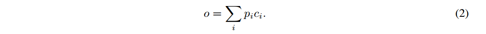
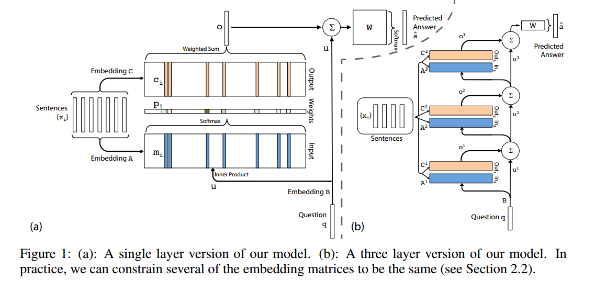
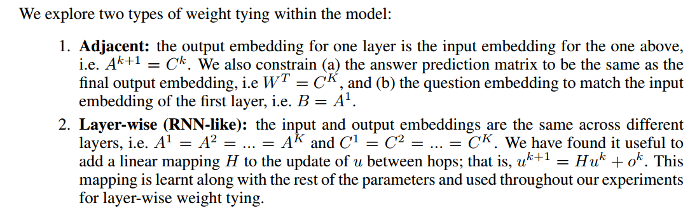
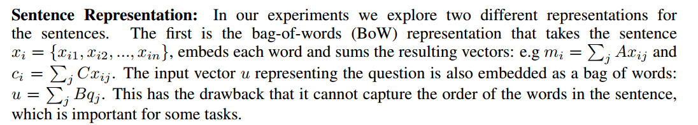
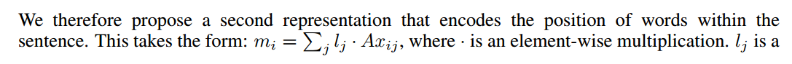
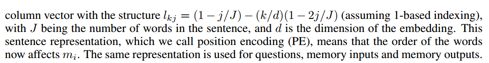
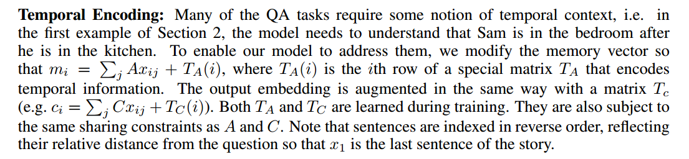

# End-To-End Memory Networks

我们在可能较大的外部存储器上引入了一个具有循环注意模型的神经网络。该架构是记忆网络的一种形式，但与该工作中的模型不同，它是端到端训练的，因此在训练过程中需要的监督要少得多，使其更普遍适用于现实环境。

> 端到端是什么意思？指的是通过一个统一的模型或系统直接从原始输入端到最终输出端完成任务，而无需人工设计中间阶段的特征或处理步骤。

## Introduction

人工智能研究面临的两大挑战是建立能够在回答问题或完成任务的过程中进行多个计算步骤的模型，以及能够描述顺序数据中的长期依赖关系的模型。

我们的模型也可以被看作是RNNsearch的一个版本，每个输出符号有多个计算步骤(我们称之为“跳数”)。我们将通过实验证明，长期记忆的多跳对于我们的模型在这些任务上的良好性能至关重要，并且训练记忆表示可以以可扩展的方式集成到我们的端到端神经网络模型中。

## Approach

我们的模型取一个离散的输入集合x1，…， xn，将存储在内存中，查询q，并输出答案a。

xi, q和a中的每一个都包含来自有V个单词的字典的符号。该模型将所有x写入到内存中，直到一个固定的缓冲区大小，然后为x和q找到一个连续的表示。然后通过多跳处理连续表示以输出a。这允许在训练期间通过多次内存访问将错误信号反向传播回输入。

先一层一层地来看

输入内存表示:假设给定一个输入集合x1，…， xi要存储在内存中。

$x_i$被转化为d维向量$m_i$，这是通过emmbedding来实现的，文章中提到了使用一个嵌入矩阵A，实际上pytorch的embedding模块也是使用这种方式。

查询q也被嵌入(同样，在最简单的情况下，通过与A具有相同维数的另一个嵌入矩阵B)来获得一个内部状态u。意思是说q使用了另外一个embedding来做嵌入。

两个相乘就是计算它们之间的余弦相似度了，记为p

输出存储器表示:每个xi都有一个相应的输出向量ci(在最简单的情况下由另一个嵌入矩阵C给出)。然后，存储器o的响应向量是对转换后的输入ci的和，并由输入的概率向量加权:

生成最终预测:在单层情况下，输出向量o和输入嵌入u的和然后通过最终权重矩阵W(大小为V × d)和softmax来生成预测标签:

整体模型如图1(a)所示。在训练过程中，通过最小化A和真标签A之间的标准交叉熵损失来联合学习所有三个嵌入矩阵A、B和C以及W。训练使用随机梯度下降进行。

这个实验的数据集中给出的答案就是一个单词（当时我也觉得奇怪，为什么最后的输出就是一个向量，看了实验部分才知道，答案就只有一个单词）

重复堆叠多次，构成了最终的模型

这里主要说了一些更加细致的实现

## 实验部分

句子表示:在我们的实验中，我们探索了句子的两种不同的表示。第一种是词袋(BoW)表示，它采用句子xi = {xi1, xi2，…， xin}，嵌入每个单词并对结果向量求和:例如mi = P j Axij和ci = P j Cxij。表示问题的输入向量u也嵌入为一个单词包:u = P j Bqj。这样做的缺点是无法捕捉句子中单词的顺序，而这对于某些任务来说是很重要的。

简单来说，就是一个句子怎么表示的问题，一个句子可以分为多个单词，这里说的词袋法就是对这么多个单词的嵌入取一个加权平均。有一定缺陷：丢失了顺序性，后面讨论如何改进

这个l携带了顺序信息

其中J是句子中的单词数，d是嵌入的维数。这种句子表示，我们称之为位置编码(PE)，意味着单词的顺序现在影响mi。同样的表示用于问题、记忆输入和记忆输出。

时间编码方式，也是在词袋法之上改进，但是编码是可学习的

通过注入随机噪声来学习时不变性:我们发现添加“虚拟”记忆来正则化TA是有帮助的。也就是说，在训练时，我们可以随机添加10%的空记忆到内存中。我们把这种方法称为随机噪声(RN)。