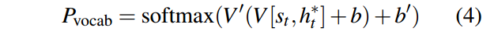
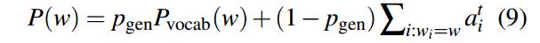
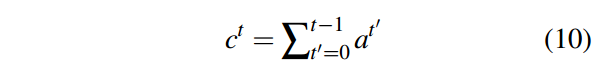

# Get To The Point: Summarization with Pointer-Generator Networks

这篇文章是做文本摘要的。以前的模型有两个缺点:它们容易不准确地再现事实细节，并且它们倾向于重复自己。在这项工作中，我们提出了一种新的架构，以两种正交的方式增强了标准的序列到序列注意模型。首先，我们使用了一个混合的指针-生成器网络，它可以通过指向从源文本复制单词，这有助于准确地复制信息，同时保留了通过生成器产生新单词的能力。其次，我们使用覆盖来跟踪已经总结的内容，这就阻止了重复。

## Introduction

摘要是将一段文本压缩成包含原文主要信息的较短版本的任务。总结有两种广泛的方法:抽取和抽象。提取方法专门从直接取自源文本的段落(通常是完整的句子)中收集摘要，而抽象方法可能会生成源文本中没有的新单词和短语——就像人类撰写的摘要通常所做的那样。

提取方法更容易，因为从源文档复制大块文本可以确保基本的语法水平和准确性。

另一方面，对高质量的总结至关重要的复杂能力，例如释义、概括或现实世界知识的整合，只有在抽象框架中才有可能实现。

尽管以前的系统很有前途，但它们表现出了一些不受欢迎的行为，比如不准确地再现事实细节、无法处理词汇表外(OOV)单词，以及重复自身。

我们的混合指针-生成器网络便于通过指向从源文本复制单词(Vinyals等人，2015)，这提高了OOV单词的准确性和处理，同时保留了生成新词的能力。该网络可以被视为抽取和抽象方法之间的平衡。

我们提出了一种来自神经机器翻译的**覆盖向量**的新变体(Tu等人，2016)，我们使用它来跟踪和控制源文档的覆盖。我们发现覆盖对于消除重复非常有效。

## 模型部分

在本节中，我们将描述(1)我们的基线序列到序列模型，(2)我们的指针生成器模型，以及(3)我们可以添加到前两个模型中的任何一个的覆盖机制。

代码是用tensorflow写的

### 序列到序列注意力模型

上图就是baseline模型：Seq2Seq-attention模型

文章wi的令牌一个接一个地输入编码器(单层双向LSTM)，产生一系列编码器隐藏状态hi。在每一步t上，解码器(单层单向LSTM)接收前一个词的词嵌入(在训练时，这是参考摘要的前一个词;在测试时，它是由解码器发出的前一个单词，并且具有解码器状态st。注意分布的计算公式为Bahdanau et al (2015):

仔细看图，输入的每一个单词，得到了对应的hidden_state，在每一个时间步上又会输出一个state，加上可学习的attention，得到e，对e做softmax，得到注意力分数

它告诉解码器在哪里查找以产生下一个单词。接下来，注意力分布用于生成编码器隐藏状态的加权和，称为上下文向量h * t:

这里的h * t在解码器中与时间步t有关，而前面和时间步t有关的是什么呢？仔细看公式发现只有解码器状态st

上下文向量可以看作是这一步从源中读取的内容的固定大小表示，它与解码器状态st连接，并通过两个线性层馈入以产生词汇表分布Pvocab:

这两个V可以视作是两个全连接网络

其中V, v0, b, b0为可学习参数。

Pvocab是词汇表中所有单词的概率分布，它为我们提供了预测单词w的最终分布。

损失函数：

带*的wt是真实的单词

### Pointer-generator网络

我们的指针生成器网络是我们的基线和指针网络的混合体(Vinyals等人，2015)，因为它既允许通过指向复制单词，也允许从固定的词汇表生成单词。

在指针生成器模型(如图3所示)中，注意分布at和上下文向量h * t的计算方法如第2.1节所示。另外，根据上下文向量h∗t、解码器状态st和解码器输入xt，计算时间步长t的生成概率pgen∈[0,1]:

其中向量wh *， ws, wx和标量BPTR是可学习的参数，σ是sigmoid函数。

**接下来，pgen被用作软开关，用于选择是通过从Pvocab中采样来从词汇表中生成单词，还是通过从注意力分布at中采样来从输入序列中复制单词**。对于每个文档，让扩展词汇表表示词汇表和源文档中出现的所有单词的并集。

我们得到了扩展词汇表上的如下概率分布:

注意，如果w是一个超出词汇表(OOV)的单词，那么Pvocab(w)为零，如果w未出现在源文件中，则∑i:wi= wtai为零。

生成OOV单词的能力是指针生成器模型的主要优点之一;相比之下，像我们的基线这样的模型被限制在它们预设的词汇中。

损失函数如式(6)和式(7)所示，但其相对于式(9)中给出的修正概率分布P(w)。

### Coverage mechanism

前面神神秘秘的覆盖机制，但是我还是保留原文比较好，暂时不知道怎么翻译比较好

重复是序列到序列模型的常见问题，并且在生成多句子文本时特别明显(见图1)。我们采用Tu等人(2016)的覆盖模型来解决这个问题。在我们的覆盖模型中，我们维持一个覆盖向量ct，这是所有先前解码器时间步长的注意力分布之和:

直观地说，ct是源文档单词的(非标准化)分布，表示这些单词迄今为止从注意力机制中获得的覆盖程度。注意，c0是一个零向量，因为在第一个时间步，源文档中没有任何内容被覆盖。

将覆盖向量作为注意力机制的额外输入，将式(1)变为:

这里多引入了c这一个参数

其中wc是与v长度相同的可学习参数向量，这确保了注意力机制的当前决策(选择下一个参加的地点)是通过提醒其之前的决策(在ct中总结)来通知的。这将使注意力机制更容易避免重复关注相同的位置，从而避免产生重复的文本。

我们认为有必要(见第5节)额外定义覆盖损失，以惩罚反复前往同一地点的行为:

我们的损失函数更灵活:因为总结不应该要求统一的覆盖，我们只惩罚每个注意力分布和到目前为止的覆盖之间的重叠-防止重复关注。最后，将覆盖损失，通过一些超参数λ重新加权，加入到初级损失函数中，得到一个新的复合损失函数:

