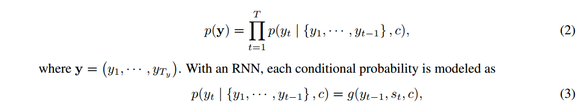
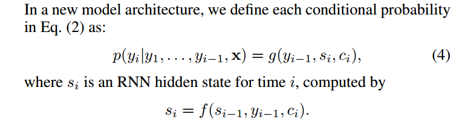
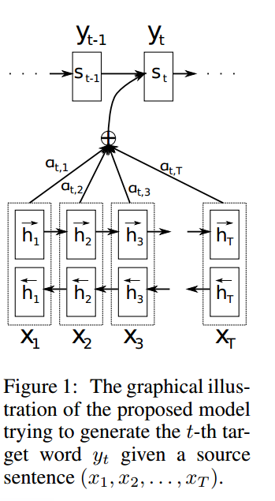
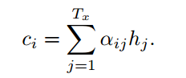
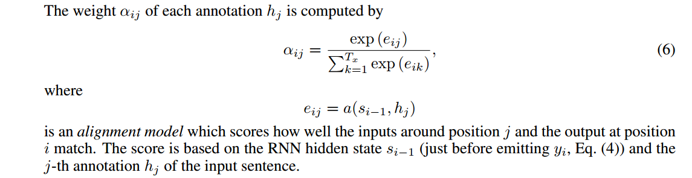

# NEURAL MACHINE TRANSLATION BY JOINTLY LEARNING TO ALIGN AND TRANSLATE

在本文中，我们推测使用固定长度向量是提高基本编码器-解码器架构性能的瓶颈，并建议通过允许模型自动(软)搜索源句子中与预测目标词相关的部分，而不必将这些部分明确地形成硬段来扩展这一点。

## Introduction

提出了编码器-解码器架构存在的问题：神经网络需要能够将源句子的所有必要信息压缩成固定长度的向量（个人理解：最后都会转化为[num_seq, batch_size, num_hidden]的向量，这样一来信息被压缩成为num_hidden长度的向量了）。这可能会使神经网络难以处理长句子，特别是那些比训练语料库中的句子更长的句子。

为了解决这个问题，我们引入了一种扩展的编码器-解码器模型（扩展？具体扩展在哪里？），该模型可以学习对齐和翻译。

每次提出的模型在翻译中生成一个单词时，它(软)搜索源句子中**最相关**信息集中的一组位置。然后，该模型根据与这些源位置和之前生成的所有目标单词相关的上下文向量来预测目标单词。

**这种方法与基本编码器-解码器最重要的区别在于，它不试图将整个输入句子编码为单个固定长度的向量。相反，它将输入的句子编码成一个向量序列，并在解码翻译时自适应地选择这些向量的子集。这使神经翻译模型不必将源句子的所有信息(无论其长度如何)压缩到固定长度的向量中。我们证明了这可以让模型更好地处理长句子。**

在本文中，我们证明了联合学习对齐和翻译的方法比基本的编码器-解码器方法显著提高了翻译性能。对于较长的句子，这种改善更为明显，但对于任何长度的句子都可以观察到。

## 框架结构

新架构由一个双向RNN作为编码器和一个解码器组成，该解码器在解码翻译过程中模拟搜索源句子。

应该注意的是，与现有的编码器-解码器方法(参见Eq.(2))不同，这里的概率取决于每个目标词yi的不同上下文向量ci。

<u>先说解码器</u>

2、3式：

c表示的上下文始终没有变过，一直都是encoder的输出

新的架构：

c表示的上下文在不断根据时间步的不同而改变

上下文向量ci依赖于编码器将输入句子映射到的一系列注释(h1、···、hTx)。每个注释都包含关于整个输入序列的信息，重点关注输入序列第i个单词周围的部分。

然后，上下文向量ci被计算为这些注释hi的加权和:

是一个对齐模型，它对位置j周围的输入和位置I的输出匹配程度进行评分。分数基于RNN隐藏状态si−1(就在发出yi之前，Eq.(4))和输入句子的第j个注释hj。

我们将对齐模型a参数化为一个前馈神经网络，该网络与所提出的系统的所有其他组件共同训练。

直观地说，这在解码器中实现了一种注意机制。解码器决定源句子中需要注意的部分。通过让解码器具有注意机制，我们减轻了编码器必须将源句子中的所有信息编码为固定长度向量的负担。使用这种新方法，信息可以分散在注释序列中，解码器可以相应地有选择地检索这些注释。

<u>编码器:双向RNN注释序列</u>

关于双向RNN已经有视频介绍过了，细节就是它输出的hidden_size是原来的两倍

## 实验部分

介绍了数据集WMT ’14

用到了beam search

