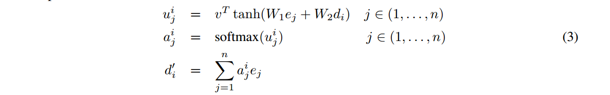

# Pointer Networks

我们引入了一种新的神经结构来学习输出序列的条件概率，输出序列的元素是与输入序列中的位置相对应的离散token。现有的方法，如序列到序列和神经图灵机，不能轻易地解决这些问题，因为输出的每一步目标类的数量取决于输入的长度，而输入的长度是可变的。

我们的模型使用最近提出的神经注意机制解决了可变大小输出字典的问题。

它与之前的注意力尝试的不同之处在于，它不是使用注意力将编码器的隐藏单元混合到每个解码器步骤的上下文向量中，而是使用注意作为指针来选择输入序列中的一个成员作为输出。我们称这种架构为指针网(Ptr-Net)。

我们展示了Ptr-Nets可以用来学习三个具有挑战性的几何问题的近似解——寻找平面凸壳、计算Delaunay三角形和平面旅行推销员问题——仅使用训练示例。

Ptr-Nets不仅改进了具有输入注意力的序列到序列，而且还允许我们推广到可变大小的输出字典。

## Introduction

rnn有其局限性：输入和输出以固定帧速率可用（可能说的是输入和输出的单词是固定的，只能从词汇表中取）。

在本文中，我们通过重新利用注意力机制来创建指向输入元素的指针来解决这一限制。

解决了三个组合问题，关于具体问题没什么必要了解细节了。

## 模型部分

首先回顾了一下Seq2Seq模型（这个已经在上一篇文章中提到过了，故略）

然后提到了**基于内容的输入注意力**

具体是这样做注意力的：

e是encoder的hidden state，而d是decoder的hidden sate，最后，将$d_i^{'}$和$d_i$连接起来作为我们进行预测的隐藏状态，并将其馈送到循环模型的下一个时间步。

**该模型在凸包问题上的表现明显优于序列到序列模型，但不适用于输出字典大小取决于输入的问题。然而，模型的一个非常简单的扩展(或者更确切地说是简化)使我们能够轻松地做到这一点。**

最后提到了关键的***指针网络***

它能够让输出的字典大小取决于输入

在这里，我们没有混合编码器状态ej来向解码器传播额外的信息，而是使用$u_j^i$作为指向输入元素的指针。