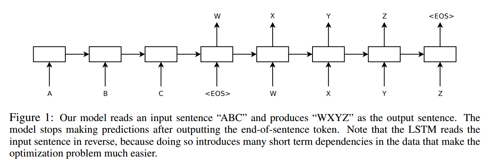
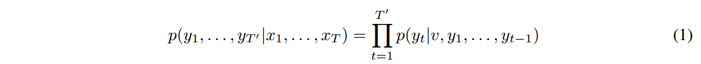

# Sequence to Sequence Learning with Neural Networks

用神经网络进行序列到序列学习

## 摘要

论文中提到，尽管DNN在大型标记训练集可用时工作得很好，但它们不能用于序列到序列的映射。本文中提到的方法是使用多层长短期记忆(LSTM)将输入序列映射到一个固定维数的向量，然后使用另一个深度LSTM从该向量解码目标序列。

结果是：BLUE分数很高（34.8）

使用LSTM对SMT系统产生的1000个假设进行重新排序时，其BLEU分数增加到36.5，接近之前的SOTA。LSTM还学习了对语序敏感、对主动语态和被动语态相对不变的敏感短语和句子表征。最后，他们发现反转所有源句子(而不是目标句子)中的单词顺序显著提高了LSTM的性能，因为这样做引入了源和目标句子之间的许多短期依赖关系，从而使优化问题变得更容易。

## Introduction

大的DNN效果很好，但它只能应用于输入和目标可以用固定维向量进行合理编码的问题。这就造成了很大的局限性，因为许多问题是事先不知道序列的长度的。

本文使用LSTM架构来解决Seq2Seq问题，其思想是使用一个LSTM读取输入序列，一次一个时间步，以获得大的固定维向量表示，然后使用另一个LSTM从该向量提取输出序列(图1)。

我们的模型读取一个输入句子“ABC”，并产生“WXYZ”作为输出句子。该模型在输出句子结束标记后停止进行预测。请注意，LSTM反向读取输入句子，因为这样做会在数据中引入许多短期依赖项，从而使优化问题容易得多。

令人惊讶的是，LSTM在非常长的句子上没有受到影响。在源句子中颠倒单词的简单技巧是这项工作的关键技术贡献之一。

LSTM的一个有用的特性是，它学习将可变长度的输入句子映射到固定维的向量表示。

做了一些定性评价，表明我们的模型意识到语序，并且对主动和被动语态有一定的稳定性。

## 模型

先是介绍了一下RNN

只要事先知道输入和输出之间的对齐，RNN就可以很容易地将序列映射到序列。然而，如何将RNN应用于输入和输出序列长度不同且关系复杂且非单调的问题，目前还不清楚。

一般序列学习的一个简单策略是使用一个RNN将输入序列映射到固定大小的向量，然后使用另一个RNN将向量映射到目标序列。虽然它原则上可以工作，因为RNN提供了所有相关信息，但由于产生长期依赖关系，很难训练RNN。然而，众所周知，长短期记忆(LSTM)学习具有长时间依赖性的问题，因此LSTM可能在这种情况下取得成功。

Seq2Seq任务的数学表示：

大概意思是说，在给定输入序列x的前提下，预测出序列y的概率等于在预测出的序列和v(序列x学习到的表示)的前提下，预测下一个token的概率的连乘积

我们要求每个句子以一个特殊的句尾符号`<EOS>`结尾，总体的方案就如图1所示。

有三点需要注意：

1. 使用了两个不同的LSTM：一个用于输入序列，一个用于输出序列，因为这样做可以在忽略不计的计算成本下增加数量模型参数，并且很自然(
2. 深层LSTM的性能明显优于浅层LSTM，因此我们选择了一个四层LSTM。(感觉也是为了增加参数
3. 我们发现将输入句子的单词顺序颠倒是非常有价值的。(于是颠倒了顺序，有点双向RNN的感觉

## 实验

介绍了数据集

使用一个从左到右的束搜索来搜索最可能的翻译，具体是：保留了少量的B个部分假设，其中部分假设是某些翻译的前缀在每一个时间步，我们用词汇表中的每一个可能的词扩展光束中的每一个部分假设。这大大增加了假设的数量，因此根据模型的对数概率，除了B个最可能的假设外，我们放弃了所有的假设。一旦`<EOS>`符号被附加到一个假设之后，它就会从束中移除，并被添加到完整的假设集合中。

beam search 有点类似于动态规划的方式，而不是每次贪心取最大可能性的答案

对颠倒句子的顺序做出了解释：
